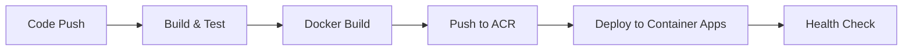

# Slack Bot TODO アプリ - Azure アーキテクチャ設計書

**作成日**: 2025 年 8 月 30 日  
**バージョン**: v1.0  
**プロジェクト**: todo_slackapp

## 📋 プロジェクト概要

小規模チーム向けの Slack Bolt フレームワークベースの TODO アプリケーション。Azure Container Apps と Cosmos DB を活用し、コスト効率を重視した設計。

### 要件サマリー

- **対象ユーザー**: 小規模チーム（10-20 人）、同時ユーザー数人程度
- **主要機能**: Slack メッセージを通じた TODO の CRUD 操作
- **技術要件**: 3 秒以内の応答時間、リアルタイム性重視
- **コスト要件**: 月額 1,000 円以下を目標

## 🏗️ アーキテクチャ設計

### システム構成図

```
┌─────────────────┐    ┌──────────────────────┐    ┌─────────────────┐
│                 │    │                      │    │                 │
│     Slack       │◄──►│   Azure Container    │◄──►│   Azure Cosmos  │
│   Workspace     │    │        Apps          │    │       DB        │
│                 │    │   (Slack Bolt App)   │    │   (TODO Data)   │
└─────────────────┘    └──────────────────────┘    └─────────────────┘
                                 │
                                 ▼
                       ┌──────────────────────┐
                       │                      │
                       │   Azure Key Vault   │
                       │  (API Credentials)   │
                       │                      │
                       └──────────────────────┘
                                 │
                                 ▼
                       ┌──────────────────────┐
                       │                      │
                       │ Application Insights │
                       │   (Monitoring)       │
                       │                      │
                       └──────────────────────┘
```

### アーキテクチャコンポーネント

| コンポーネント                 | 目的                          | 構成/SKU                                          |
| ------------------------------ | ----------------------------- | ------------------------------------------------- |
| **Azure Container Apps**       | Slack Bolt アプリホスティング | 消費プラン（0.2 vCPU、0.4 GiB）、自動スケーリング |
| **Azure Cosmos DB**            | TODO データストレージ         | NoSQL API、無料枠（400 RU/s、25 GB）              |
| **Azure Container Registry**   | Docker イメージ管理           | Basic SKU                                         |
| **Azure Key Vault**            | 認証情報管理                  | Slack API トークン、接続文字列                    |
| **Azure Application Insights** | 監視とログ                    | 基本監視、パフォーマンス追跡                      |
| **GitHub Actions**             | CI/CD パイプライン            | 自動ビルド・デプロイ                              |

## 🎯 機能仕様

### Slack インターフェース

#### 対応コマンド

- `@todobot add [タスク内容]` - 新しい TODO 追加
- `@todobot list` - 全 TODO 一覧表示
- `@todobot done [ID]` - TODO 完了マーク
- `@todobot delete [ID]` - TODO 削除

#### 応答例

```
ユーザー: @todobot add 買い物に行く
Bot: ✅ TODO「買い物に行く」を追加しました（ID: 1）

ユーザー: @todobot list
Bot: 📝 TODO一覧
1. 買い物に行く [未完了]
2. 会議資料準備 [未完了]

ユーザー: @todobot done 1
Bot: ✅ TODO「買い物に行く」を完了にしました
```

### データモデル（Cosmos DB）

```javascript
{
  "id": "unique-uuid",
  "title": "買い物に行く",
  "status": "pending|completed",
  "createdAt": "2025-08-30T10:00:00Z",
  "completedAt": "2025-08-30T15:30:00Z", // 完了時のみ
  "userId": "slack-user-id",
  "userName": "user-display-name",
  "channelId": "slack-channel-id"
}
```

## 🔧 技術仕様

### アプリケーション層

- **フレームワーク**: Slack Bolt for Node.js/TypeScript
- **ランタイム**: Node.js 18 LTS
- **パッケージマネージャー**: npm
- **API 設計**: RESTful API + Slack Event API

### データ層

- **データベース**: Azure Cosmos DB (NoSQL API)
- **パーティション戦略**: channelId によるパーティション
- **インデックス**: userId, status, createdAt
- **TTL**: 完了タスクは 1 年後自動削除（オプション）

### インフラ層

- **コンテナ**: Docker
- **オーケストレーション**: Azure Container Apps
- **レジストリ**: Azure Container Registry
- **ネットワーク**: HTTPS/TLS 暗号化

## 🔒 セキュリティ設計

### 認証・認可

- **Slack 認証**: OAuth 2.0 Bot Token
- **Azure 認証**: Managed Identity
- **アクセス制御**: チーム内 Slack メンバーのみ

### データ保護

- **暗号化**:
  - 転送時: HTTPS/TLS 1.2+
  - 保存時: Cosmos DB 標準暗号化
- **シークレット管理**: Azure Key Vault
- **監査ログ**: Application Insights

## 💰 コスト分析

### 月額コスト予想（小規模利用時）

| サービス             | SKU/プラン | 月額コスト     |
| -------------------- | ---------- | -------------- |
| Container Apps       | 消費プラン | ¥0-200         |
| Cosmos DB            | 無料枠     | ¥0             |
| Container Registry   | Basic      | ¥600           |
| Key Vault            | 標準       | ¥200           |
| Application Insights | 無料枠     | ¥0             |
| **合計**             |            | **¥800-1,000** |

### コスト最適化戦略

1. **Container Apps 消費プラン**: 使用時のみ課金
2. **Cosmos DB 無料枠**: 400 RU/s + 25 GB まで無料活用
3. **自動スケーリング**: トラフィックに応じた自動調整
4. **効率的なクエリ**: RU 消費量を最小化

## 🚀 デプロイメント戦略

### CI/CD パイプライン（GitHub Actions）



### デプロイメント手順

1. **ローカル開発**: Docker Compose 環境
2. **テスト環境**: Container Apps（開発用）
3. **本番環境**: Container Apps（本番用）
4. **監視**: Application Insights ダッシュボード

## 📊 監視・運用

### パフォーマンス監視

- **応答時間**: 3 秒以内の応答保証
- **可用性**: 99.9%を目標
- **スループット**: 100 req/min 対応

### ログ・メトリクス

- **アプリケーションログ**:構造化 JSON 形式
- **メトリクス**: リクエスト数、応答時間、エラー率
- **アラート**: 応答時間超過、エラー率上昇時

### トラブルシューティング

- **Application Insights**: リアルタイム監視
- **Live Metrics**: パフォーマンス状況確認
- **Log Analytics**: 詳細ログ分析

## 📈 スケーラビリティ

### 現在の制限

- **同時ユーザー**: 20 人程度
- **データ量**: 25GB 以下
- **リクエスト**: 400 RU/s 以下

### 拡張計画

- **ユーザー数増加**: Container Apps 水平スケーリング
- **データ量増加**: Cosmos DB 有料プランへアップグレード
- **機能追加**: マイクロサービス分割検討

## 🔄 今後の拡張予定

### Phase 2 機能

- [ ] TODO 期限設定・通知機能
- [ ] チーム別 TODO 管理
- [ ] 定期タスク機能

### Phase 3 機能

- [ ] BI・レポート機能
- [ ] Slack 以外のチャットツール対応
- [ ] モバイルアプリ開発

## 📝 開発ガイドライン

### コーディング規約

- **言語**: TypeScript（strict mode）
- **フォーマッター**: Prettier
- **リンター**: ESLint
- **テスト**: Jest + Supertest

### Git ワークフロー

- **ブランチ戦略**: GitHub Flow
- **コミットメッセージ**: Conventional Commits
- **レビュー**: Pull Request 必須

## 📞 サポート・連絡先

- **プロジェクトオーナー**: hondouchi
- **リポジトリ**: https://github.com/hondouchi/todo_slackapp.git
- **Issue 管理**: GitHub Issues

---

**最終更新**: 2025 年 8 月 30 日  
**次回レビュー予定**: 実装開始後 1 週間
